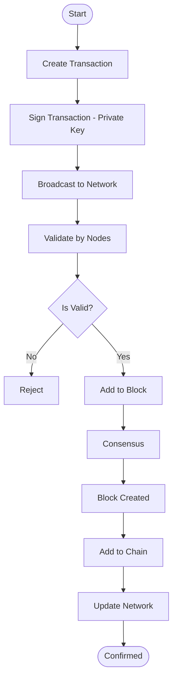

# 🚀 Blockchain Network Flow Architecture

## 📌 Overview

This project demonstrates the internal workflow of a Blockchain Network using a structured flowchart. It explains how transactions are created, validated, processed, and permanently stored on the blockchain.

---

## 🧠 Blockchain Flow Diagram

---

## 🔍 Process Breakdown

### 1️⃣ Transaction Creation

* A user initiates a transaction.
* The transaction is digitally signed using a private key.

### 2️⃣ Broadcasting

* The transaction is broadcast to all nodes in the blockchain network.

### 3️⃣ Validation

* Nodes verify:

  * Digital signature
  * Account balance
  * Double-spending prevention

### 4️⃣ Block Formation

* Valid transactions are grouped into a block.

### 5️⃣ Consensus Mechanism

* The network agrees on the block using:

  * Proof of Work (PoW)
  * Proof of Stake (PoS)

### 6️⃣ Block Addition

* The new block is linked to the previous block using cryptographic hashing.

### 7️⃣ Network Update

* The updated blockchain is distributed across all nodes.

### 8️⃣ Confirmation

* The transaction is confirmed and becomes immutable.

---

## ⚙️ Technologies (Optional)

* Blockchain Concepts
* Cryptography (Hashing, Digital Signatures)
* Distributed Systems
* Consensus Algorithms

---

## 📊 Use Cases

* Cryptocurrency Systems (Bitcoin, Ethereum)
* Smart Contracts
* Secure Communication Systems
* Decentralized Applications (DApps)

---

## 📌 Notes

* This diagram is compatible with GitHub Markdown (Mermaid supported).
* You can visualize it directly in your repository.

---

## 🧑‍💻 Author

**MASUOD NAJEI**

---

## ⭐ Contribution

Feel free to fork, improve, and contribute to this project.

---

